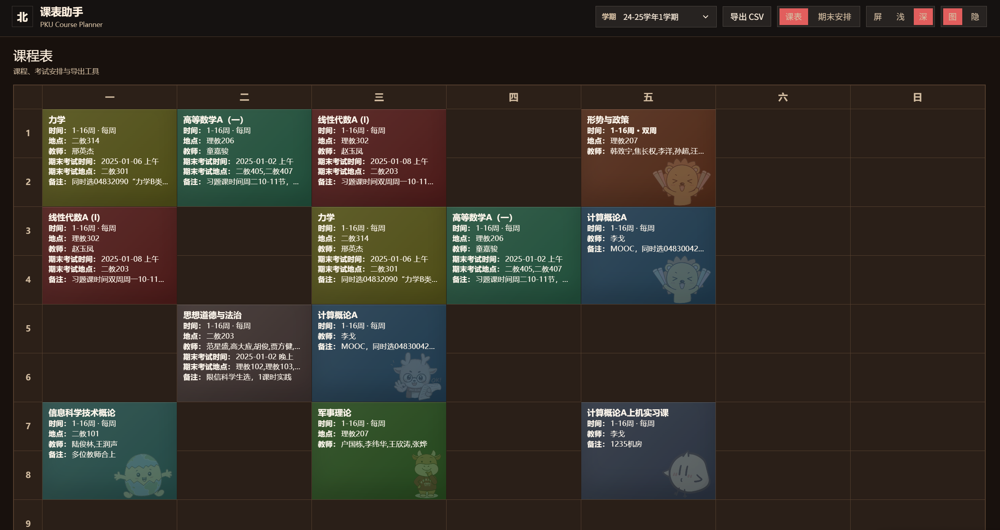
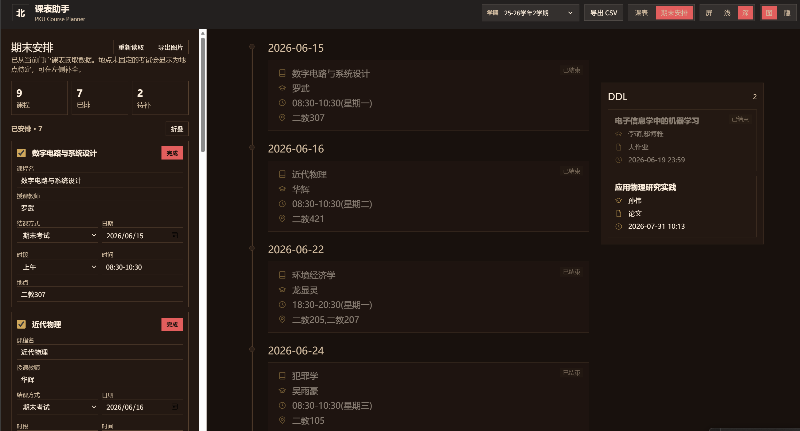
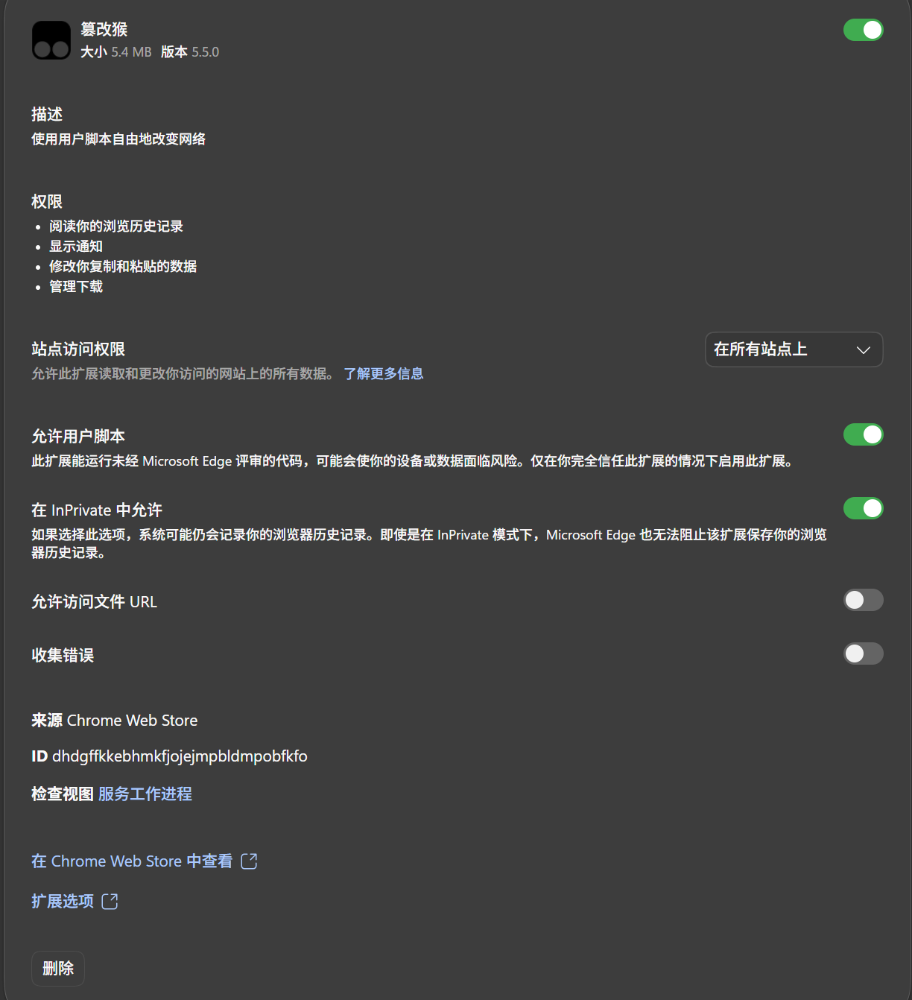

# PKU Course Planner Userscript

一个用于北大门户课表页的 Tampermonkey 脚本。它会在浏览器本地生成更清爽的课表视图、可编辑期末安排，并支持导出 Wakeup 课程表 CSV。

## 功能

- 重构课表界面，隐藏原页面中占位较大的头图和标题区。
- 使用统一顶栏切换「课表 / 期末安排」和「跟随系统 / 浅色 / 深色」以及「简笔画图形开启 /隐藏」。
- 保留课程颜色、单双周、星期、节次等核心信息。
- 课程格显示时间、地点、教师、期末考试时间、期末考试地点等字段。
- 课程格空白较多时自动加入低透明院系吉祥物简笔画装饰。

- 自动生成可编辑的期末安排时间轴和ddl(目前支持期末考试、随堂考试、大作业、论文)。
- 支持将期末安排导出为 PNG 图片。

- 支持按 Wakeup 课程表模板导出 CSV。
- 所有课程数据和手动补充信息只保存在浏览器本地。

## 安装
目前支持chrome内核浏览器，推荐使用Edge或Chrome。
1. 打开edge浏览器右上角三个点，下面找到插件（直接点右侧链接也可），安装 [Tampermonkey（篡改猴）](https://www.tampermonkey.net/)。下载黑色的就行。
2. 点击[课表美化](extension://dhdgffkkebhmkfjojejmpbldmpobfkfo/ask.html?aid=75e21e66-86b2-4e42-b645-7d9260547296)下载脚本

下载过PKU-ART2（教学网美化）的忽略以下步骤

3. 回到插件，鼠标移到插件上，在弹出的左侧菜单选“管理插件”，开启开发人员模式。之后点开篡改猴的详细信息，设置权限如下：

## 使用

1. 打开 `https://portal.pku.edu.cn/publicQuery/#/myCourseTable`(就是门户网站的“我的课表”)。
2. 刷新页面，或切换学期/周次，让课表重新加载。
3. 顶栏可切换课表视图、期末安排视图和颜色模式。
4. 在期末安排页可补全缺失地点、日期、结课方式等信息。
5. 点击「导出图片」保存期末安排时间轴和ddl。
6. 点击「导出 CSV」生成 Wakeup 可导入的课程表文件。

## Wakeup CSV

导出的 CSV 字段与 Wakeup 模板保持一致：

```text
课程名称,星期,开始节数,结束节数,老师,地点,周数
```

说明：

- 星期使用 `1-7`。
- 连续节次会合并为一条记录。
- 字段内半角逗号会转换为中文顿号，减少导入失败。
- 单独某一周不会追加单双周后缀。
- 空字段会填入 `无`。

## 隐私

脚本不保存账号密码，不读取或上传 Cookie。课程数据和你手动编辑的补充信息保存在当前浏览器的 `localStorage` 中。

## 兼容性

- 推荐使用 Edge 或 Chrome。
- 需要 Tampermonkey。
- 仅适配北大门户课表页。

## 开发

这是一个纯 userscript 项目，没有构建步骤。修改后可用 Node.js 做基本语法检查：

```bash
node --check pku-exam-timeline.user.js
```

## License

MIT
